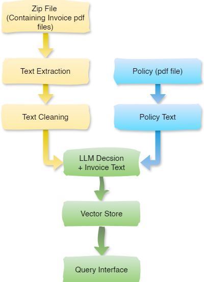

# Invoice Reimbursement System
 
## Project Overview

The **Invoice Reimbursement System** is an AI-powered application designed to automate the comparison of invoice details with reimbursement policies using natural language understanding. Users can upload invoice and policy PDFs, and the system performs intelligent analysis to determine if the invoice complies with the given reimbursement policy. It leverages state-of-the-art language models, vector similarity search, and retrieval-augmented generation (RAG) techniques to generate human-like explanations for compliance decisions using **LangGraph** framework for RAG.

---

## Features

- **Document Storage**: Store documents as vector embeddings with metadata in a persistent Chroma vector database (locally)
- **Semantic Search**: Perform similarity searches using HuggingFace embeddings
- **Custom Retrievers**: Create configurable retrievers for different search strategies
- **Error Handling**: Robust exception handling and logging
- **Configuration**: Easy configuration through a central config file

---

## Tools and Technologies Used

| Category               | Tool/Technology                     |
|------------------------|-------------------------------------|
| Backend Framework      | FastAPI                             |
| Frontend Interface     | Streamlit                           |
| Embeddings             | HuggingFace `all-mpnet-base-v2`     |
| Vector Store           | ChromaDB (Persistent mode)          |
| LLM (Text Generation)  | Groq ("llama3-70b-8192")            |
| Document Parsing       | `PyMuPDF`                           |
| RAG Framework          | LangGraph                           |
| UUID Support           | Python’s `uuid` module              |
| File Format            | PDF (`.pdf`)                        |

---

## Installation Instructions

1. **Clone the Repository**
   ```bash
   git clone https://github.com/Gaurav0963/invoice-reimbursement-system.git
   cd invoice-reimbursement-system
   ```
2. **Setup Environment Variables**
    ```
    GROQ_API_KEY = "..."
    API_URL = "http://localhost:8080"
    export LANGSMITH_TRACING="true"
    export LANGSMITH_API_KEY="..."
    ```

3. **Create a Python Virtual Environment**
   ```bash
   python -m venv venv
   venv\Scripts\activate  # On Linux (Ubuntu 24.04): source venv/bin/activate
   ```
   ```
   # (Recomended) create virtual environment using conda
   # Run following commands in terminal
   conda create -n IRSbot python=3.10 -y
   conda activate IRSbot 
   ```

4. **Install Dependencies**
   ```bash
   pip install -r requirements.txt
   ```

5. **Run FastAPI Backend**
   ```bash
   # Option 1: Run backend (main.py) via uvicorn at port 8080
   uvicorn main:app --reload --port 8080
   ```
   ```bash
   #Option 2: Run main.py directly (automatically runs at port 8080)
   python main.py 
   ```

6. **Run Streamlit Frontend**
   ```bash
   streamlit run app.py
   ```

---

## Usage Guide

### Streamlit UI

1. Upload an **Invoice ZIP file** and a **Policy PDF** through the web interface.
2. Click on “Analyse” to process the claim and store the LLMs result in Chroma Vector DB.
3. View decision summaries with markdown-style output.

### FastAPI Endpoints

| Endpoint                 | Method | Description                                |
|--------------------------|--------|--------------------------------------------|
| `/process_claim/`        | POST   | Upload and embed invoice and policy files  |
| `/chat/`                 | POST   | Ask a question to analyze compliance       |

Example request for querying:

```json
{
  "query": "Is employee eligible for travel allowance reimbursement?",
  "employee_name": "John Doe",
  "date": "2024-05-15"
}
```

---

## ⚙️ Technical Details

- **Embedding Model**: HuggingFace’s `sentence-transformers/all-mpnet-base-v2` is used to generate semantic embeddings of invoice and policy chunks.
- **Vector Database**: ChromaDB is used in persistent mode to store vectors locally, supporting filtering by metadata such as employee name, status, reason, and date.
- **LLM**: Groq’s API is integrated to handle reasoning and response generation using `llama3-70b-8192`.
- **Chunking**: Documents are split into overlapping text chunks using LangChain's `RecursiveCharacterTextSplitter` to optimize semantic retention.
- **Architecture**:
  - PDF Loader -> Text Extractor and Cleaner -> Embeddings -> ChromaDB
  - User Query -> Embedding -> Similarity Search -> Prompt -> LLM Response

---

## Prompt Design

Prompts are carefully constructed to give context about:

- Invoice metadata (invoice_id, employee_name, status, reason, date)
- Relevant policy rules
- The query intent

**Example Template:**

```
You're Insurance claims analyst. Analyze this invoice against the policy and provide a response in EXACTLY this JSON format:
```json
{{
    "customer_name": "Customer Name here",
    "reimbursement_status": "accept | partially accept | reject",
    "reason": "Detailed explanation with Specific policy clauses and Approved Amount here",
    "date": "Invoice Date Here",
    "invoice_ID": "Invoice ID Here",
    "invoice_text": "specify invoice text content here"
}}

Policy Document:
{policy_text}

Invoice Details:
{invoice_text}
```

This ensures the model performs context-aware and faithful decision-making.

---

## Challenges & Solutions

### Challenge: Maintaining response relevance with long PDFs
**Solution**: could employ chunked RAG retrieval with metadata filtering to keep LLM focused on the correct context. SInce the invoice pdfs are very small, so this is not implementedin the presented code.

### Challenge: Extracted text is broken and could be confusing to LLM (esp. Names)
**Solution**: Used regex to fix the common words and employed a stronger cleaning functions (esp. for invoices) as it was difficult to extract the name correctly.

### Challenge: LLM omits required fields (e.g., date) or adds " " inside values of `reason` key.
**Solutions**: Still looking...